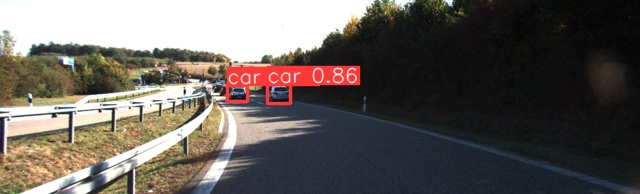

# Tracking on KITTI dataset using YOLOv8 and modified SORT tracker with UKF filter

<p align="center">
  
</p>

## Main Setup
1. Install python3.8 and select (e.g. by using `pyenv`)
2. Create and activate virtual environment of your choice (e.g. `python3 -m venv venv`)
3. Install numpy `pip install numpy==1.21.0`
4. Install other requirements: `pip install -r requirements.txt`
4. Run benchmark.py :


## Evaluation
1. Clone TrackEval: `git clone https://github.com/JonathonLuiten/TrackEval.git`
2. Install requirements: `pip install -r TrackEval/requirements.txt` or `pip install -r TrackEval/minimum_requirements.txt`
3. Run tracking on the entire kitti dataset
4. Run `TrackEval/scripts/run_kitti.py`
5. Results are in folder(s) `TrackEval/data/trackers/kitti/kitti_2d_box_train/{tracker_name}`

# Usage:
```bash
python benchmark.py  recording.mp4
python benchmark.py  recording.mp4 --model finetuned --filter ukf --max_age 20 --iou_threshold 0.3


Available options:
video (str) - Path to recording
model (str) default = 'pretrained' - Model variant, can be 'pretrained' or 'finetuned'
filter (str) default = 'kalman' - Filter version, can be 'kalman' or 'ukf'
max_age (int) default = 4 - Tracker max_age
min_hits (int) default = 2 - Tracker min_hits
iou_threshold (float) default = 0.2 - Tracker iou_threshold
framerate (int) default = 30 - Video framerate
```
# Project Description

## Introduction
The goal of this project was to implement an object tracking algorithm and benchmark it in the 2D Multiple Object Tracking task on the KITTI Tracking dataset.

Multiple object tracking is a computer vision task that involves detecting and tracking multiple objects in a video sequence. The goal is to identify and locate specific objects in each frame, and then associate them across frames to track their movements over time. This task is challenging due to factors such as occlusion, motion blur, and changes in object appearance, and is usually solved using algorithms that integrate object detection and data association techniques.

## Solution
We decided to use the YOLOv8 nano model as the detector. Due to the model's good performance and high-quality documentation, we considered it best suited for our problem. The nano version was chosen due to limited computational resources. To better adapt the model to our data, we fine-tuned the algorithm on the KITTI dataset. For the tracking algorithm, we chose Simple Online and Realtime Tracking (SORT). This is a proven and popular algorithm that serves as the basis for several newer solutions such as OC-SORT and DeepSORT. To improve its performance, we replaced the standard Kalman Filter with the Unscented Kalman Filter (UKF). Theoretically, this filter should handle non-linear object movements in images better. To test the algorithm's performance, we ran it on the KITTI dataset.

## Fine-tuning YOLOv8
Fine-tuning was conducted using the KITTI dataset available at: https://www.cvlibs.net/datasets/kitti/eval_object.php. It contains 7481 training examples and 7518 test examples. Only the training subset was used for training and evaluating the network. The total number of objects in this subset is around 40,000.

The dataset is characterized by a high dominance of the car class. The objects in the images were primarily located at their centers. Training parameters are available in the run folder. The training process is presented in the figure below.

The model learned to recognize cars more accurately, which were the dominant class, but lost some ability to recognize certain other objects. Additionally, the new model has more trouble recognizing small objects.





## Tracking Algorithm
We decided to base our approach on the SORT (Simple Online Realtime Tracking) algorithm. In each frame, the algorithm receives detections from the detector. Each object in the image is modeled by a separate Kalman filter. For each frame, predictions from the Kalman filter are matched to the detector observations using the Hungarian algorithm based on the Intersection Over Union (IoU) metric. If a bounding box is not currently tracked, the algorithm initiates tracking by modeling its movement with a Kalman filter. SORT outputs the predictions from the Kalman filters. By controlling the min_hits parameter, we can ignore objects on the output that haven't been matched enough times, allowing us to discard unexpected detector anomalies. The max_age parameter allows the algorithm to track an object using the Kalman filter for a specified number of frames, even if the detector doesn't detect it, which helps handle temporarily occluded objects. We decided to test the UKF (Unscented Kalman Filter) algorithm, a more advanced version of the Kalman filter. This algorithm should handle non-linear motion in images better.

## Evaluation
Finally, we evaluated the models on the KITTI dataset (https://www.cvlibs.net/datasets/kitti/eval_tracking.php) using the TrackEval library (https://github.com/JonathonLuiten/TrackEval). The KITTI dataset contains 21 image sequences, which were made into videos serving as input for the detection and tracking program. The dataset contains around 8000 images of varying sizes from 1224x370 px to 1242x376 px depending on the sequence. Each image sequence is accompanied by a file describing the correct detection and tracking of objects. Several classes related to road traffic are distinguished: various types of cars, cyclists, pedestrians, and a "DontCare" class, which replaces any detected class that doesn't concern the road user. Metrics were calculated for cars and pedestrians for each combination of models and filters.

<p align="center">
  
  
</p>
<p align="center">
  
  
</p>
<p align="center">
  
  
</p>
<p align="center">
  
  
</p>


## Summary
After fine-tuning, YOLOv8 performs significantly better at detecting objects from the KITTI dataset. Without additional training, the model returns more objects, but sometimes these are false positives. Moreover, fine-tuning increases the model's confidence. The version of SORT with the UKF (Unscented Kalman Filter) is more advanced but achieves similar results to the basic version for cars. Unfortunately, the algorithm encounters more difficulties with pedestrians. Likely, the dataset doesn't contain many instances of non-linear motion where the UKF filter could leverage its advantage. Additionally, due to having more parameters than the basic Kalman filter, the UKF filter may require further precise tuning. Experimenting with different Sigma points could probably improve results. Results for the pre-trained YOLOv8 model wasn't generated due to incorrect mapping of the network output classes to the KITTI dataset classes.


